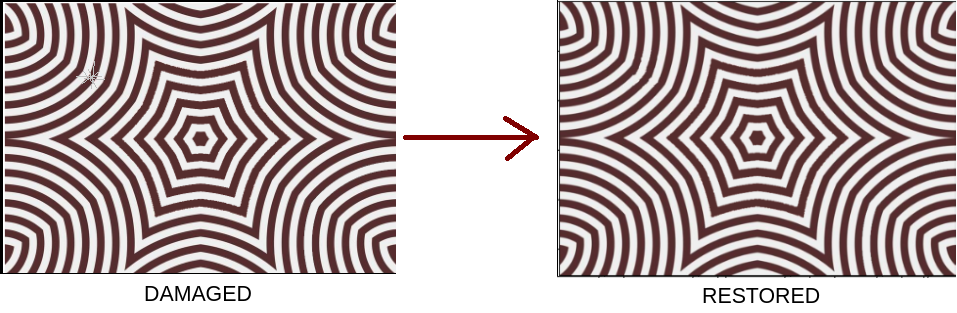

# Crystal eye: Linear Algebra Project 2022

Computer vision algorithm for inpainting corrupted part of image.

## Description

Helps you to restore scratched or crumpled image. \
Also, can be used for small objects deletion from the image.



## Usage

1. Put scratched images in ./data/ folder.
2. Change algorithm configuration to use your image in file ./src/config.txt. Specify image files in the next format.

```
path = cover.jpg
beta = 0.8
patch_size = 6
x_step = 4
y_step = 4
target_region = 100, 130, 160, 190
...

```

3. Run start script.

```shell
[user@pc .]$ cd ./src
[user@pc ./src]$ python start.py
```

4. Wait. Results and used parameters will be in folder ./results/{your_file_name}/.

## Realization

Details of realization and theoretical part behind can be found in corresponding project report in ./Project_report.pdf.

## Contributors

- [Viktor Povazhuk](https://github.com/viktorpovazhuk)
- [Petro Hentosh](https://github.com/PHentosh)
- Yaroslav Tsymbalista

## Acknowledgements

We want to appreciate the help of Nataliya Terlych during this long way.